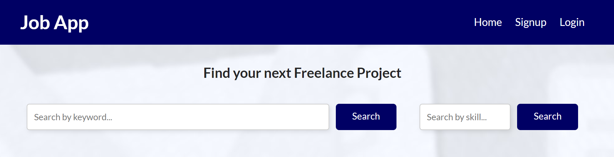

# JobApp
JobApp es una aplicación diseñada para buscar y gestionar anuncios de proyectos freelance de todo el mundo, provinentes de otras webs o creados por Admin. La app cuenta con dos roles. Los Users podrán interacturar con los proyectos pudiendo guardar en favoritos y redirigir a varios portales. Los Admin podrán crear, editar y eliminar proyectos y usuarios. JobApp está desplegada en render. [Presentacion de negocio](https://www.canva.com/design/DAGJyoC0uiI/qm-zwJaakfXQAHNhzuGZ0A/view?utm_content=DAGJyoC0uiI&utm_campaign=designshare&utm_medium=link&utm_source=editor "presentacion de negocio")

## Objetivos
- ✅ **Diseño del Frontend:** Diseño responsive, mobile-first, semántica HTML5.
- ✅ **Vistas con Pug:** Generación de vistas utilizando la librería Pug.
- ✅ **Endpoints Web:**  Implementación de los 7 endpoints web solicitados.
- ✅ **Endpoints API:**  Implementación de los 10 endpoints solicitados, divididos en job, user y fav.
- ✅ **User / Admin:** Diferentes vistas y elementos según el rol.
- ✅ **JWT Tokens:**  Implementación de autenticación mediante Json Web Token.
- ✅ **Scraping:**  Implementación de scraping en dos sitios web de proyectos freelance.
- ✅ **Bases de datos:**  Configuración y despliegue de bases de datos en MongoDB y PostgreSQL.
- ✅ **Github:** Uso de ramas, forks y pull requests para la gestión del proyecto.
- ✅ **Despliegue:** Despliegue de la aplicación en Render, con bases de datos en Render y Atlas.

## Tecnologías
- ⚙️ **Frontend:** HTML, CSS, JavaScript, librería Pug.
- ⚙️ **Backend:** Node.js, Express, API Rest, Express Web Scrapping.
- ⚙️ **BBDD:** MongoDB, PosgreSQL.
- ⚙️ **Cloud:** MongoDB Atlas, Render.

## Diagrama de arquitectura


## BBDD . Modelo Entidad Relacion y Modelo Lógico
Debida al diferente uso del dato, hemos divido el almacenamiento de los jobs en MongoDB y users / favoritos en PosgreSQL, funcionando en la práctica la tabla SQL de favoritos como una tabla intermedio entre la tabla de Users y la collection Jobs.


## Diseño de producto
Wireframes iniciales para el diseño de las diferentes vistas a generar en Pug.


## Funcionalidades Principales
- **Nivel Usuario:**
  - Registro, inicio de sesión y gestión de perfil de usuario.
  - Búsqueda y filtrado de anuncios por habilidades.
  - Los ussuarios pueden marcar y gestionar favoritos de anuncios.
- **Nivel Administrador:**
  - Creación, edición y eliminación de ofertas de trabajo.
  - Creación, edición y eliminación de usuarios.
  - Actualización de la base de datos con nuevas ofertas de trabajo mediante scraping.

## Configuración y Uso
1. **Instalación de Dependencias:**
   ```bash
   npm install
2. **Variables de Entorno:**
    - Crea un archivo `.env` en el directorio raíz y configura las variables necesarias como `PORT`, `DB_URL`, etc.
3. **Ejecución:**
    ```bash
    npm start
4. **Documentación:**
    - Para generar la documentación utilizando JSDoc:
    ```bash
    npm run docs
5. **Testing de CRUDs:**
    - Para realizar testing utilizando Jest:
    ```bash
     npm test

## Estructura de Carpetas
La aplicación sigue una estructura organizada para facilitar el mantenimiento y escalabilidad:
- **config:** Contiene archivos de configuración para bases de datos MongoDB y PostgreSQL.
- **controllers:** Controladores que manejan la lógica de las solicitudes HTTP.
  - `users.controllers.js`: Operaciones CRUD para usuarios.
  - `web.controllers.js`: Vistas y operaciones web.
- **middlewares:** Middlewares para el registro de solicitudes.
- **models:** Define modelos de datos para la aplicación.
  - `favorites.models.js`: Modelo para favoritos.
  - `jobs.models.js`: Modelo para anuncios.
  - `users.models.js`: Modelo para usuarios.
- **public:** Archivos estáticos como CSS y JS.
- **queries:** Consultas SQL para favoritos y usuarios.
- **routes:** Define las rutas de la aplicación.
  - `favorites.routes.js`: Rutas para favoritos.
  - `jobs.routes.js`: Rutas para anuncios.
  - `users.routes.js`: Rutas para usuarios.
  - `web.routes.js`: Rutas web.
- **services:** Contiene servicios que encapsulan la lógica de negocio, como `jobs.services.js`.
- **utils:** Utilidades como `scraper.js`.
- **validators:** Validadores para diferentes entidades como favoritos, anuncios y usuarios.
- **views:** Vistas en formato Pug para páginas de la aplicación.

### Archivos en carpeta raíz
- `index.js`: Archivo principal de la aplicación.
- `.env`: Archivo de configuración de variables de entorno.
- `jsdoc.json`: Configuración para generación de documentación con JSDoc.
- `package.json`: Archivos de configuración de npm.
- `queries.sql`: Archivo con consultas SQL.

## Documentación API
Documentación API en el siguiente [link de Swagger](https://jobapp-w73i.onrender.com/api-docs/)

## Contribución
Si deseas contribuir a este proyecto, por favor sigue los estándares de código, haz fork del repositorio y envía tus pull requests.

## Autores
- Diego Blázquez Rosado
- Emilio Latorre Guerra
- Eduardo Fatou Cerrato

## Licencia
GNU General Public License (GPL)
